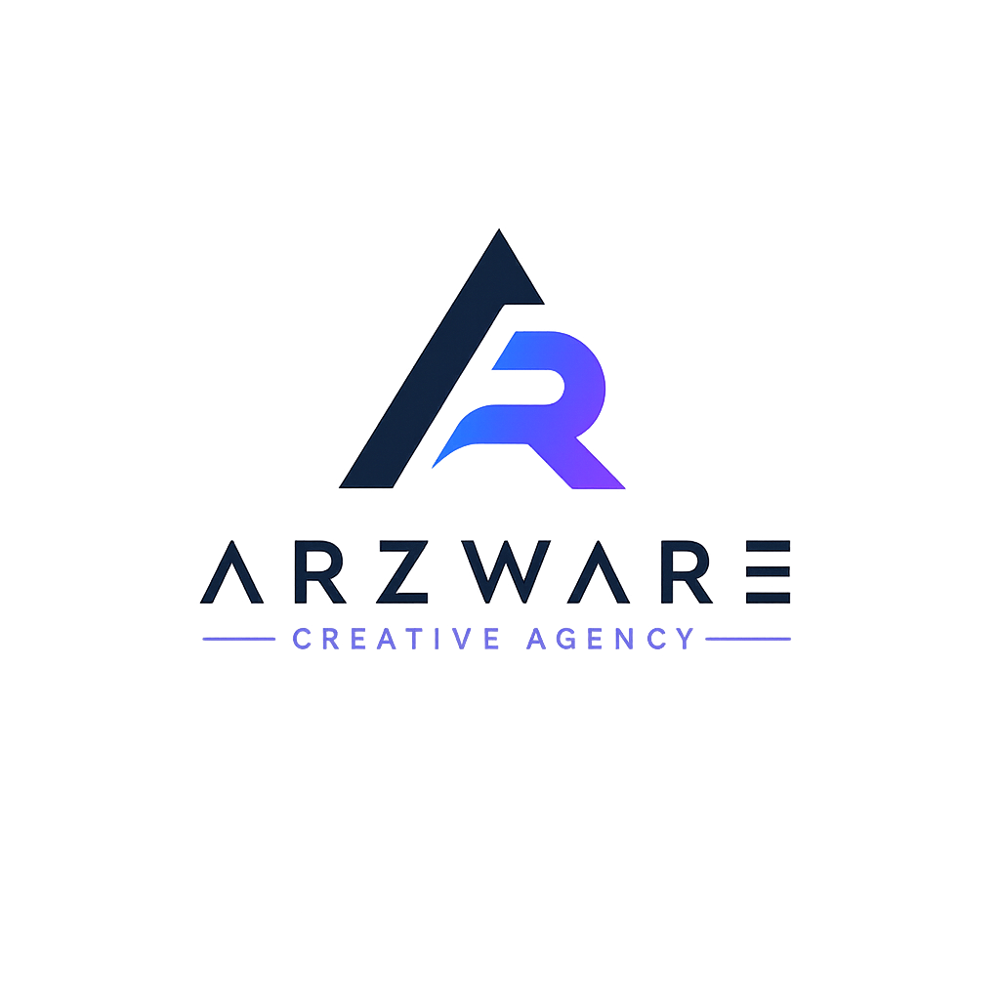

<![CDATA[# ARZWARE — Creative Agency

A premium, conversion-focused landing page for **ARZWARE** — an AI-native creative agency modernizing outdated websites, manual workflows, and disconnected operations into scalable digital systems, automation, dashboards, and AI-assisted solutions.



---

## Overview

ARZWARE is positioned as a high-end transformation partner, not a generic web agency. This landing page communicates the brand's methodology, services, case studies, and operating philosophy through an editorial newspaper-inspired design system.

## Tech Stack

| Technology | Purpose |
|---|---|
| **HTML5** | Semantic structure |
| **CSS3** | Styling, responsive design, animations |
| **Vanilla JavaScript** | Interactivity, scroll effects, counters |
| **Google Fonts** | Bebas Neue, Instrument Serif, DM Mono |

## File Structure

```
arzware/
├── index.html          # Page structure (semantic HTML5)
├── styles.css          # All styling (mobile-first responsive)
├── script.js           # All interactivity & animations
├── assets/
│   └── arzware_logo_nw.png
└── README.md
```

## Color Palette

Derived directly from the ARZWARE logo:

| Color | Hex | Usage |
|---|---|---|
| Dark Navy | `#1B2038` | Primary dark / backgrounds / text |
| Vibrant Blue | `#4A7DFF` | Primary accent / buttons / links |
| Purple / Violet | `#8B5CF6` | Secondary accent / gradient endpoints |
| Soft Lavender | `#7B8AB8` | Muted text / subtle accents |
| Cool Paper | `#F0F2F8` | Light backgrounds |
| Cool Cream | `#E8EBF4` | Section backgrounds |

## Features

- **Responsive Design** — Mobile-first with breakpoints at 768px (tablet) and 1024px (desktop)
- **Animated Counters** — Stats animate from 0 to target when scrolled into view
- **Scroll Reveal** — Sections fade in with subtle upward motion on scroll
- **Smooth Navigation** — Anchor links scroll smoothly to sections
- **Active Nav Highlighting** — Current section highlighted in navigation
- **Mobile Hamburger Menu** — Animated 3-line toggle with X transformation
- **Toast Notifications** — Subtle feedback on CTA button interactions
- **Gradient Buttons** — Blue-to-purple gradient with hover lift effect
- **Accessibility** — Focus-visible outlines, ARIA attributes on toggle

## Getting Started

No build step required. Simply open `index.html` in a browser:

```bash
# Clone the repository
git clone git@github.com:Mohammad-Abo-Al-Ghozlan/arzware.git
cd arzware

# Open in browser
start index.html        # Windows
open index.html         # macOS
xdg-open index.html     # Linux
```

Or serve locally with any static server:

```bash
npx serve .
```

## Sections

1. **Masthead** — Brand identity with editorial date line and navigation
2. **Hero** — Bold headline with key statistics
3. **Problem** — Digital debt analysis with symptom cards
4. **Framework** — Five-phase transformation methodology
5. **Services** — Six service lines with hover effects
6. **Case Studies** — Two client transformation stories with metrics
7. **Operating System** — Internal methodology and quality standards
8. **Insights** — Three thought leadership articles
9. **CTA** — Call-to-action for systems audit
10. **Footer** — Navigation links and copyright

## License

© 2026 ARZWARE. All rights reserved.
]]>
